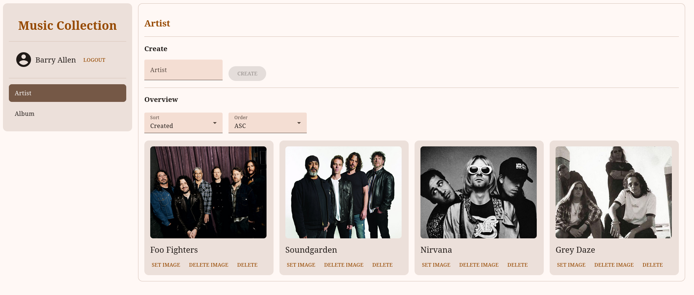
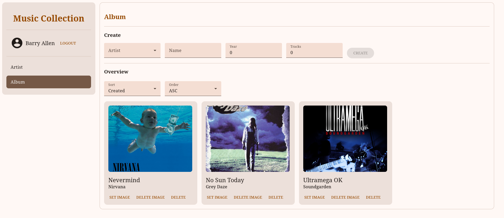

# :radio: Music Collection Frontend

This is a frontend application for managing the music-library like artists and albums.

## :framed_picture: Screenshots
### Artist Page


### Album Page


## :computer: Tech-Stack

### Development
- TypeScript
- HTML
- CSS
- Angular

### CI/CD
- GitHub Actions

## :whale: Install with Docker
Make sure the backend setup is ready, so this app can access it locally.

Create and start the container:
```bash
docker compose up -d
```
